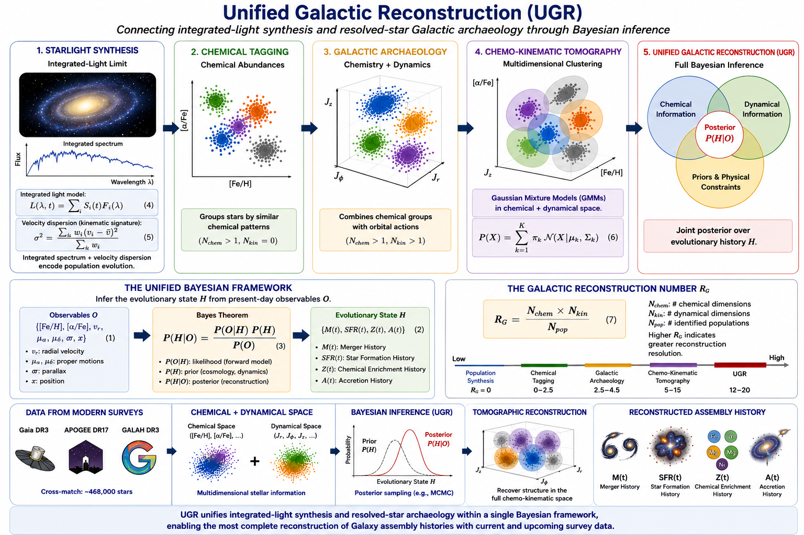
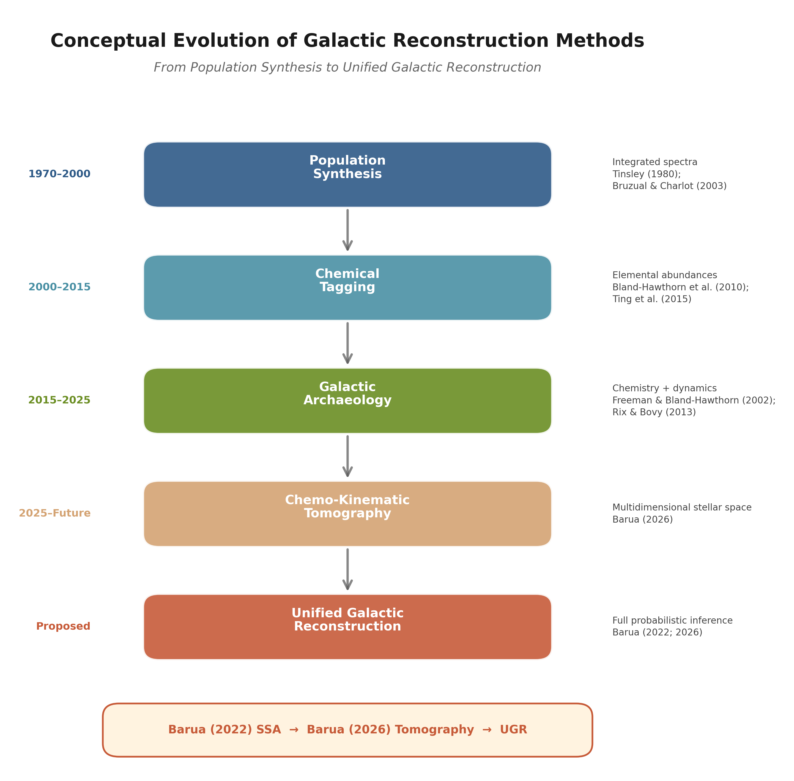
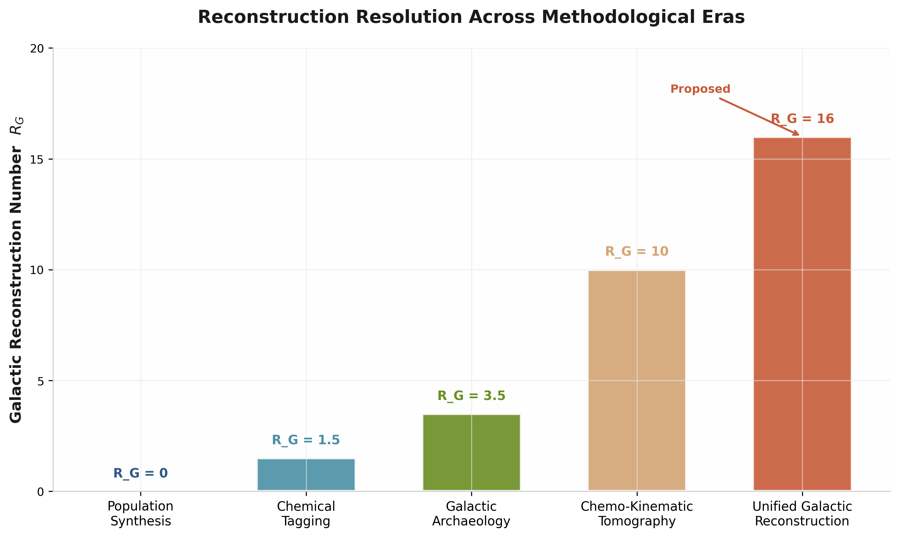
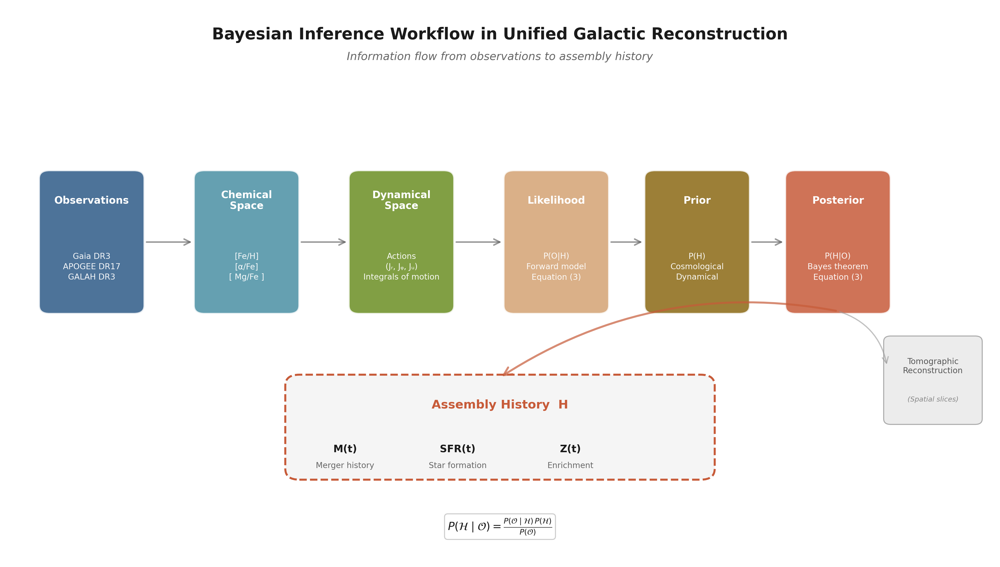

# From Starlight Synthesis to Chemo-Kinematic Tomography: A Unified Galactic Reconstruction Framework

This repository hosts the figures, graphical abstract, and supporting materials associated with the Unified Galactic Reconstruction (UGR) framework.

[](https://opensource.org/licenses/MIT)


This repository contains the conceptual framework, mathematical formulations, and visual assets for **Unified Galactic Reconstruction (UGR)**, developed by Nick Barua (2026). 

UGR treats both stellar population synthesis (integrated-light limit) and Galactic Archaeology (resolved-star limit) as special cases of a single Bayesian inverse problem, offering a unified approach to reconstructing galaxy assembly histories.

---

## 🌌 Graphical Abstract

<p align="center">
  
</p>

---

## 📝 Overview

The reconstruction of galaxy assembly histories ($\mathcal{H}$) from contemporary stellar populations remains a central challenge in astrophysics. UGR formalizes this by conditioning the full posterior over the evolutionary state simultaneously on chemical and dynamical observables, rather than treating them sequentially:

$$P(\mathcal{H}|\mathcal{O})=\frac{P(\mathcal{O}|\mathcal{H})P(\mathcal{H})}{P(\mathcal{O})}$$

Where the observed stellar properties $\mathcal{O}$ encompass elemental abundances, radial velocities, proper motions, and parallax.

### Key Contributions:
* **The Unified Framework:** Merges unresolved integrated-light synthesis pipelines and resolved-star chemo-kinematic pipelines into a single probabilistic architecture.
* **The Galactic Reconstruction Number ($R_G$):** Introduces a novel dimensionless heuristic index to quantify and compare the resolving power of different reconstruction methodologies:

$$R_G = \frac{N_{\text{chem}} \times N_{\text{kin}}}{N_{\text{pop}}}$$

---

## 📊 Methodological Workflow & Figures

### 1. Conceptual Evolution
The framework bridges historical paradigms—from early population synthesis to future survey architectures.
<p align="center">
  
</p>

### 2. Reconstruction Resolution ($R_G$ Metric)
A comparison of methodological eras using the proposed $R_G$ index, highlighting the advanced information depth achieved by UGR.
<p align="center">
  
</p>

### 3. Bayesian Inference Workflow
Information flow mapping joint constraints from multidimensional chemical and dynamical spaces directly into probabilistic assembly history.
<p align="center">
  
</p>

---

## 📋 Methodological Comparison Summary

| Era | Method | Primary Observable | $N_{\text{chem}}$ | $N_{\text{kin}}$ | $N_{\text{pop}}$ | $R_G$ |
| :--- | :--- | :--- | :---: | :---: | :---: | :---: |
| **1970–2000** | Population Synthesis | Integrated spectra | 1 | 0 | 1 | **0** |
| **2000–2015** | Chemical Tagging | Elemental abundances | 3–5 | 0 | 5–10 | **0–2.5** |
| **2015–2025** | Galactic Archaeology | Chemistry + dynamics | 3–5 | 3 | 5–10 | **2.5–4.5** |
| **2025–Future**| Chemo-Kinematic Tomography | Multidimensional space | 5–10 | 6 | 4–6 | **5–15** |
| **Proposed** | **UGR** | **Full probabilistic inference** | **10+** | **6+** | **3–5** | **12–20** |

*(Table adapted from Barua, 2026)*

---

## 🔍 Validation Strategy & Future Surveys

UGR is designed to exploit next-generation survey architectures where reconstruction capability scales as $R_G \propto N_{\text{obs}} \cdot D$. The framework provides the baseline statistical treatment required for forthcoming data releases from **Gaia DR4, LSST, Roman Space Telescope, 4MOST, and WEAVE**.

---

## 📜 Citation

If you use this framework, the heuristic metric, or any of the associated visual assets in your academic work, please cite the preprint:

```bibtex
@article{barua2026starlight,
  title={From Starlight Synthesis to Chemo-Kinematic Tomography: A Unified Galactic Reconstruction Framework},
  author={Barua, Nick},
  journal={Preprints.org},
  year={2026},
  note={Preprint under review at Preprints.org}
}

⚖️ License
This project is open-source and licensed under the MIT License.
